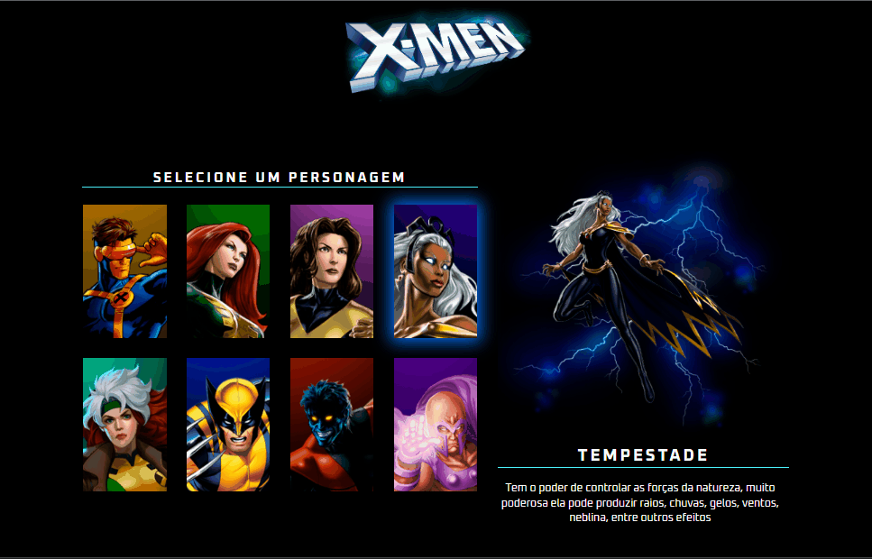

# 🖥️ Projeto X-men

## 📜 Descrição

Projeto realizado com a mentoria do Dev Quest, na semana do 0 ao programador constrato - Mapa dev week, onde consiste em fazermos um projeto juntos,aprendendo novas funcionadalidades de maneira didática e pontual.

## ✍️ Processo

- Marcação semântica HTML5
- Propriedades personalizadas de CSS3
- JavaScript
- Flexbox
- Design responsivo

### ⌨ Funcionalidades

- Ao clicar em cima do card do personagem, deve aparecer ao lado uma imagem maio correspondente, juntamente com seu nome e descrição de sua habilidade.

## 🖱️ A página

    

> <a href="https://devkarine.github.io/projeto-xmen/" target= "_blank">Acesse a página online</a>

## 👩‍💻 Dev

<table align="center">
  <tr>
    <td align="center">
      

         
          <b> Karine Pereira </b> 
            
            
      

    </td>

</tr>

</table>
